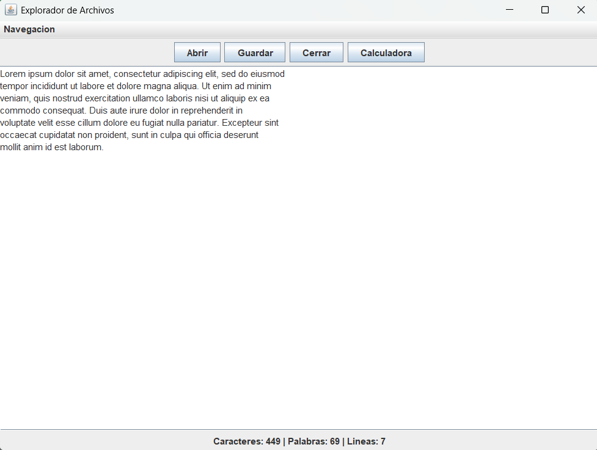

<a id="readme-top"></a>

  <h3 align="center">jframe-file-explorer</h3>

  <p align="center">
    A minimalist Java tool for browsing and managing files using a modern JFrame graphical interface.
  </p>
</div>

<details>
  <summary>Table of Contents</summary>
  <ol>
    <li>
      <a href="#about-the-project">About The Project</a>
      <ul>
        <li><a href="#built-with">Built With</a></li>
      </ul>
    </li>
    <li>
      <a href="#getting-started">Getting Started</a>
      <ul>
        <li><a href="#prerequisites">Prerequisites</a></li>
        <li><a href="#installation">Installation</a></li>
      </ul>
    </li>
    <li><a href="#roadmap">Roadmap</a></li>
    <li><a href="#usage">Usage</a></li>
    <li><a href="#license">License</a></li>
    <li><a href="#acknowledgments">Acknowledgments</a></li>
  </ol>
</details>

## About The Project



jframe-file-explorer is a lightweight, responsive Java application designed to function as a desktop file explorer. Utilizing Swing/JFrame, it offers essential functionality to open, read, display statistics, and conditionally encrypt `.txt` files directly from your workspace.

### Built With

* [![Java][Java-shield]][Java-url]

<p align="right">(<a href="#readme-top">back to top</a>)</p>

## Getting Started

To get a local copy up and running, follow these steps.

### Prerequisites

* Java JDK 11 or higher

### Installation

1. Clone the repo
   ```sh
   git clone https://github.com/jerichd4c/Proyecto-ExploradorArchivos.git
   ```

<p align="right">(<a href="#readme-top">back to top</a>)</p>

## Roadmap

- [ ] Modularize the source code for better maintainability.

<p align="right">(<a href="#readme-top">back to top</a>)</p>

## Usage

```java
import exploradorarchivos.core.*;

// Run the main method to execute the JFrame application
FileExplorer.main(new String[]{});
```

<p align="right">(<a href="#readme-top">back to top</a>)</p>

## License

Distributed under the MIT License.

<p align="right">(<a href="#readme-top">back to top</a>)</p>

## Acknowledgments
* [URU - Visual Programming](https://uru.edu)

<p align="right">(<a href="#readme-top">back to top</a>)</p>

<!-- MARKDOWN LINKS & IMAGES -->
[Java-shield]: https://img.shields.io/badge/java-%23ED8B00.svg?style=for-the-badge&logo=openjdk&logoColor=white
[Java-url]: https://www.java.com/